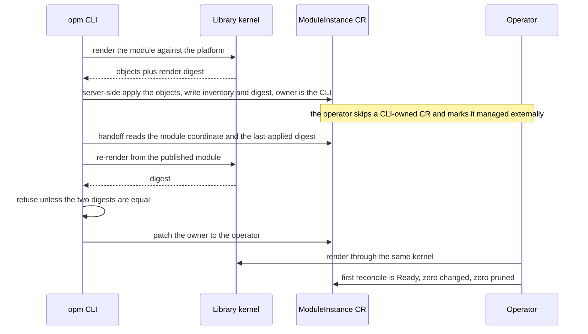

# Enhancement 0006: CLI CR Inventory, Library Kernel Adoption, and Operator Handoff

> **Delivered (2026-07-20).** Every live decision is carried by this entry's delivery log or excused in it (1 landings; `task delivery ID=0006`). The design is closed: a correction is a new enhancement that amends it, and `task show ID=0006` lists any.

OPM can deploy a module two ways: with the CLI, one shot from a laptop, or with the operator, reconciled in the cluster. Before this entry the two shared nothing. The CLI kept its record of what it had applied in a Kubernetes Secret and rendered through its own pipeline. The operator kept the same record in a custom resource and rendered through a shared kernel. A module deployed by hand could therefore never be handed over to the operator. This entry converges the CLI onto the operator's runtime contract, then adds the handover: a verified ownership flip that changes nothing in the cluster.

All entries: [INDEX.md](../../INDEX.md). How this one relates to others: [GRAPH.md](../../GRAPH.md). Metadata: [config.yaml](config.yaml).

## Summary

**The CLI writes the operator's custom resource instead of a Secret (D1).** Its inventory, the objects it applied plus the digest of what it rendered, goes into that resource's status. The CLI writes a strict subset of the status fields (D2), leaving conditions to the operator (D25). An owner marker tells the operator to skip reconciling it and say so on a condition (D3). Existing Secret inventories migrate on the next apply, with a one-release read-fallback window (D8).

**The CLI deletes its own render pipeline and renders through the shared kernel (D9).** A CLI render and an operator render of one instance are then byte-identical by construction, because both evaluate the same code. What the CLI keeps is apply: its own server-side-apply engine under its own field manager, duplicated deliberately, with server-side apply mandatory on both sides (D10).

**The CLI imports the kernel library only, never the operator (D13).** Importing the operator's types would drag in a controller framework and a GitOps toolkit, measured in this entry's research, so the CLI handles the custom resource as untyped data. It keeps its own inventory logic too: D31 reverted the plan to share that logic, because only the stored entry shape crosses the boundary and the resource schema already anchors it.

**On top of that contract sits the handoff (D7)**, forward-only, CLI to operator, with the reverse direction out of scope (D16). The CLI re-renders the published module, refuses unless the digest matches the one recorded on the resource, then patches the owner. Success is an inventory-stable reconcile rather than a byte-level no-op (D40). The kernel stamps runtime identity into a standard label, so the operator's first reconcile relabels every object by construction, and that relabel is reported rather than hidden.

**This entry consumes enhancement [0001](../0001/) rather than changing it.** D9's render path waited on 0001's kernel slice; the inventory and handoff strand (D1 to D8) did not, and D20 settled that both ship as one wave. Installing the operator is part of the surface too: a noun-first command group installing one embedded artifact, with the resource definitions a filtered subset of it (D5, D32, D35).

## How it works

Before this entry the CLI kept its inventory in a Secret and rendered through its own pipeline, so a CLI-deployed module could not be handed to the operator. Afterwards the CLI renders through the same library kernel the operator uses and applies with server-side apply under its own field manager. It records its inventory and render digest in a ModuleInstance custom resource marked as CLI-owned, which the operator leaves alone. Handoff is a verified ownership flip. The CLI re-renders the published module, refuses unless the digest equals the one recorded on the resource, then patches the owner to the operator. That operator's first reconcile changes nothing and prunes nothing, because both sides rendered the same bytes.

## Documents

1. [01-problem.md](01-problem.md): why two disjoint inventory stores and two divergent render pipelines make the learner-to-operator path impossible and handoff unsafe
1. [02-design.md](02-design.md): inventory in the custom resource, kernel adoption, CLI-side apply, the owner marker, operator install, handoff
1. [03-decisions.md](03-decisions.md): the decision log, D1 to D40
1. [04-graduation.md](04-graduation.md): what had to hold before draft became accepted
1. [05-risks.md](05-risks.md): risks, drawbacks, alternatives not taken
1. [06-operational.md](06-operational.md): observability, versioning impact, deprecation, rollback, cross-repo ordering
1. [07-questions.md](07-questions.md): the open-questions register, OQ1 to OQ18

[`contracts/`](contracts/) holds the compilable shape sketches, and [`research/`](research/) holds the dependency analysis behind D13 plus a note on development tags polluting subscription ranges.

## Scope

### In scope

- CLI inventory moves from a Secret into the operator's custom resource status (D1). The CLI writes a strict subset: inventory, the instance UUID, the last-applied fields, one readiness condition (D2).
- The CLI deletes its own render and match pipeline and renders through the kernel end to end (D9). Match behaviour is whatever the kernel ships; the CLI carries no second implementation.
- The CLI resolves its platform by precedence: an explicit flag, then the cluster's platform resource, then a local default, materialized through the same kernel calls the operator uses, with handoff forcing the cluster resource (D11). The platform carries no owner marker: the operator always owns the singleton, and in a solo cluster the CLI writes an unowned one only if absent (D12).
- The CLI keeps its own server-side apply step under its own field manager. Duplicating the operator's apply semantics is accepted, and server-side apply is mandatory on both sides (D10).
- The CLI imports the kernel library only, never the operator (D13), and handles the resource as untyped data. It keeps its own inventory logic rather than a shared package, after D31 reverted D13's plan to home that logic in the library. Its apply and prune borrows the operator's concepts, not its machinery.
- No backwards-compatibility or deprecation burden: the CLI has a single user, so it can refactor freely (D14). The CUE bump is accepted, retargeted and relocated by D36, and D8's Secret-format fallback window collapses to a one-time migration.
- An owner marker on the instance resource, with the operator skipping CLI-owned resources and saying so on a condition (D3). An operator-side change, documented here.
- Operator install and uninstall commands (D5), noun-first (D32), with uninstall semantics per D34, from one embedded artifact with a version-fetch fallback (D35). The resource definitions become a hard prerequisite for every CLI apply, gated with the inventory slice (D33).
- What the instance spec carries when applying from a local path versus a published reference (D6).
- The handoff command with digest verification: forward-only, CLI to operator (D7).
- Renaming the CLI Go module to match its siblings, as a mechanical prep slice landing before the library dependency is added (D15).
- Both a local platform and an in-cluster platform resource are first-class render sources, so OPM stays usable without cluster-admin on every path but handoff (D17).
- Migrating existing Secret inventories on apply, with a one-release read-fallback window (D8).

### Out of scope

- **Apply-engine unification.** The CLI keeps its own apply path and the operator keeps its own. Only render and match are unified, through the kernel (D10). Sharing the apply engine is future work.
- **Reverse handoff.** Flipping a reconciled resource back to CLI ownership, with its own status cleanup and relinquish-race design, is deferred (D16).
- **Handoff for the GitOps-sourced resources.** This entry covers the instance resource only; the Flux-sourced kinds have no CLI-side equivalent.
- **Rollback and revision history.** It stays operator-only; the CLI does not gain rollback here.
- **The kernel's match and materialize redesign itself.** That is enhancement [0001](../0001/); this entry consumes it and changes neither the schema nor the match algorithm.
- **Operator lifecycle beyond install and uninstall**, meaning upgrade orchestration and high availability. The install command applies manifests; it is not a package manager.

## Cross-References

| Document | Purpose |
| -------- | ------- |
| `/CLAUDE.md` (workspace root) | Cross-repo routing and the vocabulary the affects field is validated against. |
| `cli/docs/rfc/0007-moduleinstance-cr-inventory-and-operator-handoff.md` | The seed design for D1 to D8, promoted into this entry. |
| `cli/docs/rfc/0001-release-inventory.md` | The Secret-based inventory design whose storage mechanism this replaces. |
| `cli/CLAUDE.md`, `cli/CONSTITUTION.md` | Repo principles governing the slices that land in the CLI. |
| `cli/internal/inventory/`, `cli/pkg/inventory/`, `cli/pkg/ownership/` | Secret marshaling, retired here; entry identity, stale-set and collision checks, kept and ported onto the resource (D31); the ownership guard. |
| `cli/pkg/render/`, `cli/pkg/loader/` | The CLI's own render and match pipeline, deleted by the kernel-adoption slice (D9). |
| `cli/internal/workflow/apply/apply.go` | The apply workflow: rewired to render through the kernel and write the resource, keeping CLI-side apply (D10). |
| `cli/internal/kubernetes/` | The CLI's apply and delete path against the cluster, which stays CLI-owned. |
| `opm-operator/CLAUDE.md`, `opm-operator/CONSTITUTION.md` | Repo principles governing the owner-marker slice. |
| `opm-operator/api/v1alpha1/moduleinstance_types.go`, `common_types.go` | The serialized shape the CLI's writes must agree with, and where D3 adds the owner marker. Not imported by the CLI (D13). |
| `opm-operator/internal/inventory/` | Stays in place, unchanged, once D31 reverted the plan to share it. |
| `opm-operator/dist/install.yaml` | The one install artifact the CLI embeds (D5, D35); the definitions are a filtered subset of it. |
| `opm-operator/openspec/changes/archive/2026-04-12-01-cli-dependency-and-inventory-bridge/` | The original copy of CLI inventory code into the operator; historical context for D31. |
| `library/opm/` (kernel) | What the CLI imports, and the only thing it imports (D9, D31). |
| `enhancements/0001/` | The kernel redesign D9 consumes, and the gate on the kernel-adoption strand. |

## Deviations from Design

Every deviation is decision-logged; this is the index. The design accepted as D1 to D30 shipped with these reversals and refinements.

- **The shared inventory package was reverted (D31, superseding D13's shared-logic clause and D26).** It shipped, then was deleted once tracing showed only the stored entry shape crosses the actor boundary, and the resource schema anchors that. Both actors keep independent inventory logic; the slice that would have shared it was cancelled.
- **The install surface reversed to noun-first (D32, superseding D28)**, once D35 established that the resource definitions are a filtered subset of one embedded artifact.
- **The CUE bump was retargeted and relocated (D36, amending D14)**, onto the released fix line and into the earlier slice, after a trial proved the migration cost was zero. The same investigation produced D37, the sanctioned local-module workflow, and D38, a provenance annotation promoted to a fail-closed handoff pre-gate whose verification render bypasses local replacements.
- **Handoff's no-op was redefined (D40, amending D7).** The kernel stamps runtime identity into a standard label, so the operator's first reconcile relabels everything by construction. Success became the inventory-stable reconcile: ready, entry set unchanged, revision incremented, nothing pruned. Comparing digests across actors is forbidden, and the relabel is reported.
- **Single-field patches were reversed before merge.** Two helpers inverted server-side-apply semantics, where a manager's document is its complete declared intent and omitted owned fields are released, so they were deleted. One writer now owns the spec, and both the flip and the thin editor carry it whole.
- **The handoff slice gained D18 in full at drafting**, on the user's decision: it also replaced the earlier refusal arms with the thin-editor apply and a finalizer-delegating delete.
- **Three cross-actor defects surfaced only under live verification.** A version written without its prefix made every CLI-written resource unresolvable by the operator. Operator-owned delete over-claimed pruning that prune-less resources never perform. The flip's stale-snapshot race was fixed by re-reading and aborting on a generation change, which is detect-and-retry rather than atomicity.
- **A registry-hygiene finding was deferred (OQ18).** Continuous-integration development tags satisfy prerelease-tolerant subscription ranges, so an open range resolves a build nobody released. The demo now pins its catalog exactly; the systemic fix is left open.
- **Left open at graduation:** OQ15, whether the CLI and operator agree on the stale-set base relation, a consistency question rather than a safety one; OQ16, an operator apply-time collision guard, a pre-existing exposure deserving its own slice; and OQ18 above.
