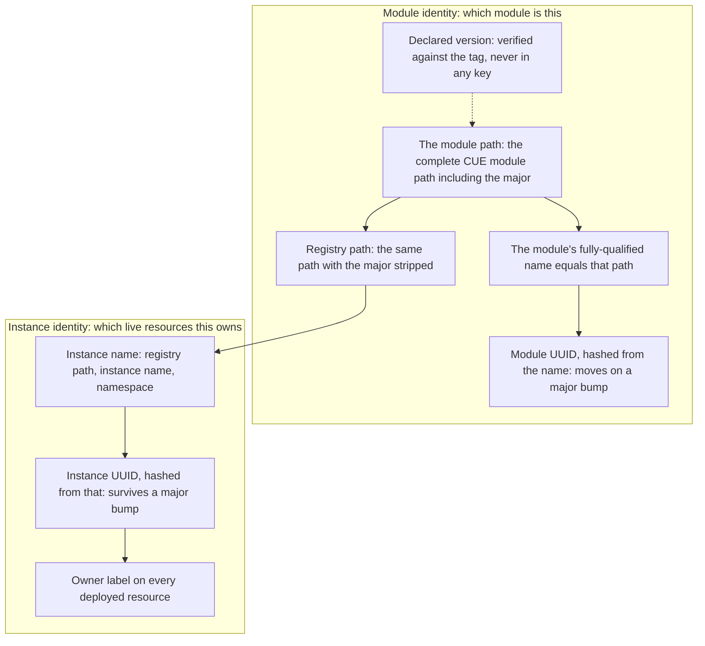

# Enhancement 0010: Module and Catalog Identity

> **Delivered (2026-08-28).** Every live decision is carried by this entry's delivery log or excused in it (21 landings; `task delivery ID=0010`). The design is closed: a correction is a new enhancement that amends it, and `task show ID=0010` lists any.

An OPM artifact is either a module a team deploys or a catalog of the definitions modules build on. Either one states its identity in more places than one, and because the full version sits inside them, the owner label on every deployed object moves whenever the module is upgraded. This entry reduced identity to one statement per artifact.

All entries: [INDEX.md](../../INDEX.md). How this one relates to others: [GRAPH.md](../../GRAPH.md). Metadata: [config.yaml](config.yaml).

## Summary

**A module's path is its whole identity, major included (D1).** The declared module path becomes the complete CUE module path with its major suffix, and that same string is the artifact's fully-qualified name. A module still declares a version, from a small identity subpackage (D2), but only so a deployed instance can derive its own version and source the version label. A reader refuses an artifact whose declared version is not the tag it was fetched by (D9).

**Two identities, and only one carries a major (D41).** A module artifact's name and uuid distinguish majors and nothing finer. An instance's name and uuid, which carry the owner label the operator prunes on, derive from the module's major-free path. So an instance survives every upgrade of the module it deploys, a major bump included.

**Identity reaches the artifact through a committed, visible file (D5).** A field may be left open, and an open field is absent rather than a placeholder (D6): CUE refuses to build on it and names the file and line. A zeroed development version would instead evaluate, render, and quietly differ from what was published.

**A contract is keyed by its API version; an implementation is keyed by its build (D4).** Resources, traits and blueprints are contracts, and their names end in a contract major their author moves when the shape breaks, independent of the catalog's release. Transformers are implementations, named with the full build version. A module demands contracts and never a transformer, so the contract is what must survive a catalog release (D25, D26, D30).

**That split lets a catalog other than the definer fulfil a contract**, say a generic backup contract implemented by a provider catalog on its own schedule. Compatibility is a promise (D27): inside one API version a contract may add but never remove. Publishing refuses a build that breaks it, a demand nothing supplies is an error (D28), and a provider-fulfilled contract resolves to exactly one transformer or fails naming the ambiguity (D32, D37).

**Reproducibility rests on the subscription, not on the key (D14).** A platform names one exact catalog build, and ranges, allow and deny lists are deleted. A catalog release is inert until someone edits that field.

## How it works

A module's identity is its complete CUE module path with the major inside it. That path is both its fully-qualified name and the input to its UUID, so two majors are two modules while patch and minor releases share one identity. The declared version is verified against the tag it was fetched by but never enters a key. A deployed instance derives its own name from the module's path with the major stripped, plus its name and namespace. The UUID stamped as the owner label on every deployed resource therefore survives a major bump, and an upgrade across majors cannot orphan what it removes. The same entry split catalog keys: a contract stays put across catalog releases, keyed by its own API version, while a transformer is keyed by the build that ships it.

## Documents

1. [01-problem.md](01-problem.md): identity is stated four times, drifts, and puts a moving version inside the label on every deployed object
1. [02-design.md](02-design.md): one identity per artifact, contract keys split from build keys, subscriptions that name their builds, and a committed identity file
1. [03-decisions.md](03-decisions.md): the decision log, D1 to D49
1. [04-graduation.md](04-graduation.md): what had to hold before draft became accepted
1. [05-risks.md](05-risks.md): risks, drawbacks, alternatives not taken
1. [06-operational.md](06-operational.md): rollout, versioning, rollback, cross-repo ordering
1. [07-questions.md](07-questions.md): the open-questions register, OQ1 to OQ17

[`schemas/`](schemas/) holds the contract and worked before-and-after values, both compiling so a wrong example is a build failure. [`experiments/`](experiments/) holds four concluded fixtures on identity discovery, closedness skew, the provenance filter and label union, and [`research/`](research/) holds the migration inventory.

## Scope

### In scope

#### Schema shape

- The shape of a module's and a catalog's metadata. The module path is the complete CUE module path and is also the fully-qualified name, no module version appears in any key, a catalog version is interpolated into every member name, and a snake-case name equals the path's leaf.
- The shape of the name type and every member's name, with **two key types split by role** (D4). A contract key covers resources, traits and blueprints and a build key covers transformers, along with the fields that feed them (D25) and how both read against a module path's major suffix.
- Where identity lives and how it gets there: a committed identity subpackage, the same shape for both artifact types (D2, D5), with fields that may be open or concrete.
- Whether the computed definition-name field survives on each member kind (D33). In scope because D8's snake-case module name is what breaks it.
- Where matching labels live (D36): a dedicated field on resources, traits, blueprints and components, unified upward from the attached members, with general metadata labels no longer unified and no longer carrying the matching vocabulary. In scope because an open question was filed against D26's label mechanism and because the normative spec states the upward union three times with no implementing code. Two riders: a workload-type label constant is deleted from the schema, having no readers, and the key is renamed under catalog ownership.

#### Matching and subscriptions

- What a subscription selects: exactly the one build it names, through a required scalar version (D14). The filter type is deleted, and ranges, allow and deny lists, the empty-filter default and the prerelease flag go with it. This is what makes a render reproducible from a commit once D4 stopped the contract key from pinning the build, so it is in scope even though the platform is otherwise enhancement 0001's.
- The arity of a contract bucket and the materialize-time error that enforces it (D32): the check lives in the kernel, not the CLI, and a transformer's owning catalog comes from materialize-time provenance rather than a parsed name. The **override** for a deliberate overlap is not in scope; D37 resolved it by prohibition and deferred the override.
- The matcher's diagnostic: the two outcomes a missed demand produces, both computed from the demanded name without deriving an owning catalog.
- How a contract states where its fulfilment comes from (D37), and the exactly-one-provider guard it carries. In scope because it makes D4's cross-catalog fulfilment a supported path rather than a tolerated one, and corrects the mechanism D32 states. The **arbitration** for a deliberate overlap stays out of scope.

#### Read-side guarantees and migration

- Read-side verification of identity, at module acquire, at catalog materialize and at platform subscription, and the typed errors it produces.
- The version label: retained in the schema, sourced from the module's declared version, and verified by the kernel against the tag the artifact was fetched by (D9).
- The identity migration: every artifact's UUID changes once, and every live instance's owner label with it.

### Out of scope

- **The commands that write identity or push artifacts.** Module and catalog publish, and the version-setting commands, belong to enhancement [0011](../0011/). This entry defines what those commands write and what a reader may assume; 0011 defines the commands.
- **Registry namespace policy, publishing credentials and tag immutability**: 0011.
- **Module version selection**, meaning how a consumer pins or ranges a module dependency. This entry fixes what a version means; choosing one is separate. Catalog subscription selection is the exception and is **in** scope (D14), because under D4's split it became the only remaining thing that could pin the transformer build a render executes.
- **Artifact discovery**: search, listing or any index over what is published. It rests on this entry's addressing guarantees but is its own concern.
- **The catalog repackage**, meaning composition and materialization semantics, which enhancement [0001](../0001/) owns. The boundary: the subscription's whole shape is in scope here because it decides which catalog bytes a render executes (D14), as is the arity of the bucket those bytes land in (D32). How catalogs are assembled and composed remains 0001's.
- **The single-build render rewrite.** This entry supplies the identity contract that work consumes, not the render change itself.

## Deviations from Design

Seven, each recorded in `config.yaml.history` where it landed.

1. **The library retarget landed twice.** The first crossing shipped against a library-owned stand-in catalog, because the original ordering put the catalogs' new authoring behind the library slices. It was reverted the same day: the stand-in duplicated the real catalog's shape knowledge with no named retirement owner. The ordering was inverted so catalogs moved first, and the redo landed against the real one.
1. **The schema slices shipped across four tags, not one release.** The operational doc describes a single cut point nothing else can move until; in practice four prerelease tags each carried part of it, leaving three partial-but-resolvable tags on the line. Only the last was ever a retarget target, and nothing in the registry distinguishes a partial tag from a complete one.
1. **The five-slice import rewrite resolved as four rewrites and two tombstones.** D47's consolidation meant two catalogs were never rewritten forward; each ended at the prerelease it had already published.
1. **D11's third read point has no library home.** The design names platform-subscription time as the earliest place to verify a catalog's identity, but nothing in the library resolves subscriptions outside materialize, and the platform loader deliberately does not. The check collapsed into the materialize read; firing earliest is a frontend concern.
1. **The operator needed feature code after all.** The design states it needs none. Retiring the platform resource's filter for D14's scalar version is versioned API work, and the controller could not compile against the retargeted library while still mapping a filter the library had deleted.
1. **The identity-authoring slice landed the identity packages but not the metadata derivation its own concern claimed.** Every module stated its version twice, and the gate compares values, so the two agreed until something moved one. The first automated bump desynchronised them and publish refused; it was fixed across all twenty modules during the republish. This is the entry's one genuine implementation gap rather than a design change.
1. **The republished fleet carries no minor-zero tags.** The seeded versions were overtaken before the republish ran, and nothing had been published at those values, so the sweep shipped what was declared.

## Cross-References

| Document | Purpose |
| -------- | ------- |
| `/CLAUDE.md` (workspace root) | Cross-repo routing and the vocabulary governing this multi-repo entry |
| `core/.claude/skills/core-schema-edit/SKILL.md` | The binding protocol for the schema slice; the spec co-update is gated by a hook and CI |
| `core/src/types.cue` | The type surface this entry rewrites: module path, name types, and the major-version type |
| `core/src/module.cue` | Module metadata: the version retained but in no key (D2), the path reshaped, the name redefined, the registry path added (D41), the major agreement left to the identity package (D45, transposing D43), and the version label retained and kernel-verified (D9) |
| `core/src/module_instance.cue` | Instance metadata: a name derived from the module's registry path and a UUID derived from that, not from the module's (D41). The one shape here that enhancement 0001 otherwise owns |
| `cli/internal/workflow/render/module.go` | The apply path with no resolved coordinate, and the reason a kernel stamp cannot cover both frontends (D9) |
| `library/opm/schema/context.go` | Where the module's name is filled under an instance-shaped field name; D41 settles which of the two that block carries |
| `core/src/catalog.cue` | Catalog metadata and the pattern constraint that stamps identity onto every transformer |
| `core/src/resource.cue`, `core/src/trait.cue`, `core/src/blueprint.cue`, `core/src/transformer.cue` | Member identity: the API version added, the version renamed to catalog version (D25), names keyed on the contract for the first three and on the build for a transformer (D4) |
| `core/SPEC.md` | The normative spec; both the version-in-name rationale and the UUID determinism argument change |
| `library/opm/helper/loader/registry/module.go` | The module read point, where the address check lands |
| `library/opm/helper/loader/internal/shape/shape.go` | Lists the declared version among the required concrete fields, unchanged under D2 |
| `core/src/transformer.cue` | The instance-version field in the transformer context: the consumer that made D2's retained version necessary |
| `library/opm/module/instance.go` | Reads the module's declared version; the instance declares none of its own |
| `library/opm/kernel/wrappers.go` | The single call the CLI and the operator both reach the registry through |
| `library/opm/materialize/materialize.go` | Where the kernel already holds each catalog's resolved version |
| `library/opm/materialize/filter.go` | The version resolution D14 deletes outright, leaving one major-agreement check on a single string |
| `library/opm/materialize/index.go` | The composed map and reverse index, built from required and optional demands together, which is why D32's guard keys on declared fulfilment (D37) rather than bucket arity; subscription provenance names the owning catalog |
| `library/opm/compile/match.go` | The always-unify step D26 and D27 make load-bearing, D30's operand denylist, the missed-key diagnostic (D28), and the candidate loop D32 leaves unchanged |
| `core/src/platform.cue` | The subscription filter deleted under D14, the scalar version it gains, and the major suffix the registry key gains under D1 |
| `core/src/module.cue`, `core/src/transformer.cue` | The computed definition-name field, read by nothing and deleted under D33 |
| `library/opm/helper/synth/render.go` | Derives the synthesized import's major by parsing a version; becomes a read of the module path |
| `library/opm/compile/execute.go` | Where a demanded name meets the composed transformer map: the matcher this entry re-keys |
| `library/opm/compile/match.go` | The same always-unify step and missed-key diagnostic, reached from the error path D30's round-trip rewrites |
| `library/opm/errors/match.go` | The unify error, which carries the component and the name structurally and so absorbs that rewrite |
| `library/opm/schema/metadata.go`, `context.go` | The Go-side module version and name fields |
| `cli/pkg/module/module.go` | The address composition that disappears |
| `cli/internal/workflow/apply/apply.go` | Writes the instance's module path and version: where the silent-downgrade defect is fixed |
| `opm-operator/api/v1alpha1/common_types.go` | The module reference, already a path with major plus a version tag; verified to need no change |
| `opm-operator/internal/apply/prune.go` | Skips deletes whose owner label disagrees with the recorded instance UUID: the constraint behind the migration's adoption path |
| `opm-operator/internal/reconcile/moduleinstance.go` | Repopulates the recorded instance UUID from each render |
| `catalog_opm/src/identity/identity.cue` | The catalog identity package this entry reshapes; the other two catalogs carried the same file until D47 consolidated them |
| `catalog_opm/src/resources/configmap.cue` | A representative leaf: imports identity, derives its own name, embeds the member into a component |
| `modules/jellyfin/module.cue`, `modules/jellyfin/cue.mod/module.cue` | The worked example in the problem statement; its dependency block pins the catalog the module carries |
| `enhancements/0011/` | The publishing half: the commands that write what this entry defines |
| `enhancements/0001/` | The catalog repackage; owns the composition and materialization semantics this entry does not touch |
