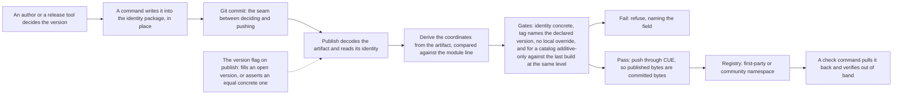

# Enhancement 0011: Module and Catalog Publishing

> **Delivered (2026-09-08).** Every live decision is carried by this entry's delivery log or excused in it (18 landings; `task delivery ID=0011`). The design is closed: a correction is a new enhancement that amends it, and `task show ID=0011` lists any.

There is no OPM publish command. Every artifact in the registry today was pushed by CUE's own publish command, wrapped in a repo-local task that decides the version by its own rules: a content checksum for modules, a copy-and-stamp for catalogs. Neither wrapper reads what the artifact says about itself, so the bytes in the registry are not the bytes anyone committed. This entry defines how an OPM artifact reaches a registry: the commands that write its version, the checks that run before a push, and where published artifacts live.

All entries: [INDEX.md](../../INDEX.md). How this one relates to others: [GRAPH.md](../../GRAPH.md). Metadata: [config.yaml](config.yaml).

## Summary

**Five commands over one pipeline (D1).** Module publish and catalog publish decode an artifact, derive its registry coordinates from what the artifact declares, run the gates, and push, never rewriting the artifact to fit a coordinate somebody typed (D2). Version authoring is a separate command on each artifact type, so a commit can sit between deciding a version and pushing one, and a flag on publish is the only other writer (D3). That flag means one thing on both types: fill a field the author left open, or assert one they made concrete (D12). A check command verifies a published catalog out of band (D7), and login sits on the registry command group (D24, renaming D11's spelling).

**Two gates carry the weight.** Publish refuses an artifact whose identity is not concrete (D4), because CUE's own publish will happily push a tree with unfilled identity fields and ordinary validation exits clean on the same tree. And publish never honours a local dependency override (D6). A module may override that with an explicit flag and a catalog may not, because a module's divergence is scoped to one artifact while a catalog's propagates into the key space of everything built against it.

**A catalog publish additionally refuses a build that breaks a contract it already published (D9).** The predecessor is found by scanning the published history backwards, prereleases included (D23, restoring D9's own rule after an implementation note conflated it with a different selector). The tag must name the version the artifact declares (D18), published artifacts are immutable (D10), and an already-published version is always a refusal, because nothing predicts a version for you (D15).

**Underneath, a central registry that hosts rather than indexes (D5).** CUE has no per-domain autodiscovery, so an artifact hosted elsewhere is unresolvable for anyone who has not edited their own configuration first. What the registry does not do is dictate names: **path ownership is domain ownership** (D13). First-party artifacts keep the project's own path prefixes, publishers without a domain get an owner-scoped path under a community prefix, and anyone with a vanity domain or their own registry uses whatever path they like. A bare host in the registry configuration is a catch-all, so a path's domain never has to match the host serving it.

## How it works

Publishing used to copy the tree, stamp a version into the copy and push bytes that never existed in git. Now the version is written into the artifact's identity package in place by a dedicated command, or filled by a flag on publish for release automation. It is committed, then read back by publish, which derives the registry repository and tag from the artifact rather than composing them from typed arguments. Before pushing, publish refuses an identity that is not concrete, a tag that does not name the declared version, and a tree carrying a local override. For catalogs it also refuses a contract that is not additive against the last published build at the same API level. The push goes through CUE itself, so what a consumer evaluates is what the author committed.

## Documents

1. [01-problem.md](01-problem.md): no publish command; three answers to what version this is; publish is silent about a divergence it can see
1. [02-design.md](02-design.md): one pipeline, two artifact types, coordinates derived, and gates that reflect blast radius
1. [03-decisions.md](03-decisions.md): the decision log, D1 to D26
1. [04-graduation.md](04-graduation.md): what had to hold before draft became accepted
1. [05-risks.md](05-risks.md): risks, drawbacks, alternatives not taken
1. [06-operational.md](06-operational.md): rollout, versioning, rollback, cross-repo ordering
1. [07-questions.md](07-questions.md): the open-questions register, OQ1 to OQ10

[`contracts/`](contracts/) states the publish decision, its gates and the tag rule as CUE shapes that fail to unify when a rule is violated; [`experiments/`](experiments/) holds three concluded fixtures on version write-back, the publish plan's gates and the compatibility gate.

## Scope

### In scope

- Module publish and catalog publish: one implementation, two entry points; coordinate derivation, the artifact-shape gate, and the push.
- The catalog version-setting command: the version writer, separate from the publisher, editing committed source in place and idempotently.
- The version flag on publish: filling an open identity field or asserting a concrete one, for flows where a release process supplies the version.
- The identity-completeness gate: publish refuses an artifact whose identity fields are not concrete.
- The local-override gate: a local dependency replacement is never honoured, its presence refuses the push, and the escape hatch exists for modules only.
- The catalog registry check, and the equivalent verification when a catalog is added to a platform's registry.
- Where published artifacts live: a central registry that hosts, with owner-scoped module paths under reserved namespace segments.
- Retiring the mechanisms this replaces: each catalog repo's copy-and-stamp publish task, the module fleet's checksum-driven bump, and its external version record.
- The migration of the published fleet to the owner-scoped namespace.

### Out of scope

- **What identity is.** The shape of the module path, the absence of a module version, the catalog's compatibility signal and the major-keyed member name belong to enhancement [0010](../0010/). This entry writes those fields and pushes the artifact carrying them.
- **Read-side verification.** The checks a consumer performs at acquire and at materialize are 0010's. This entry's checks are producer-side and are deliberately not the guarantee: CUE's own publish keeps working, so a check a publisher can route around is not one a consumer can rely on.
- **Signing, provenance and attestation**, out of scope regardless of how the credential question resolves.
- **Artifact discovery**: search, listing or any index over what is published. It rests on this entry's addressing and namespace guarantees but is its own concern.
- **The CLI's platform-resolution modes**: synthesizing a platform from a module's catalog dependencies, and honouring local overrides during development. Adjacent through the same file, but a rendering concern rather than a publishing one.
- **The registry implementation itself**: hosting, storage and access control as infrastructure. This entry states what publish requires of it.

## Deviations from Design

Six, each recorded in `config.yaml.history` where it landed. The pre-implementation note about the unbuilt major-agreement backstop is resolved and folded into the first.

1. **The major-agreement window is closed.** While this entry was in flight, nothing in shipped code checked that a declared version's major matched its path's major. Enhancement 0010's D43 and D45 each deleted a schema-side assertion on the ground that subscription selection would catch a skew, and that check was itself unbuilt. Both ends have now landed, one for the subscription check and one for the publish gate, so the relation is enforced at publish for every artifact.
1. **Automated release management was adopted for the module fleet, which D15 permits rather than requires.** D15 left conventional commits a convention and anticipated the cost of per-module components. The cutover took that option: twenty packages, a seeded manifest, one combined release request, with the version-setting command remaining the only writer of the identity file.
1. **D9's implementation note was wrong and is struck by D23.** It named the subscription float's stable-preferring selector as exactly the right predecessor selection for the compatibility gate. That is a different rule, and it coincides with the gate's only on a prerelease-only history. D23 restores D9's own sentence: a backward scan of the published history, prereleases included. The conflation never executed; it was caught in design before the gate was built.
1. **The registry cleanup split into two slices.** The original single slice covered D17's items across every fleet. The CLI's own fixture and the operator's four moved on different schedules through different pipelines, so the work landed twice, with the second slice also moving the instance fixtures to the testing domain, which D17's fifth item had left out.
1. **The authoring-commands slice landed as two changes.** The initialization half grew into its own change when the built-in templates were replaced by real published modules under a reserved segment (D25). Templates became gated artifacts published by the CLI's own release pipeline rather than text embedded in the binary.
1. **The login command was renamed before it was built.** D11 specified a top-level login command; D24 moved it onto the registry command group, and the shipped command writes the standard OCI credential file rather than CUE's own. The device-grant path D11 left open is unimplementable against the registries this fleet actually publishes to.

## Cross-References

| Document | Purpose |
| -------- | ------- |
| `/CLAUDE.md` (workspace root) | Cross-repo routing and the vocabulary governing this multi-repo entry |
| `enhancements/0010/` | The identity half: defines the fields these commands write and the read-side checks that make them trustworthy |
| `cli/CLAUDE.md`, `cli/CONSTITUTION.md` | Repo-local rules governing the command implementation |
| `cli/pkg/loader/provenance.go` | The local-override detector the publish gate reuses |
| `cli/pkg/module/module.go` | The coordinate composition that collapses into a read |
| `library/opm/helper/loader/registry/module.go` | The registry loader publish decodes through; also 0010's module read point |
| `library/opm/materialize/enumerate.go` | Enumerates a subscription's published versions: what the check command and the subscription-time check build on |
| `catalog_opm/Taskfile.yml` | The copy-and-stamp publish task this entry deletes; the other two catalogs carried the same task until 0010's D47 consolidated them, leaving one flow to retire |
| `catalog_opm/CLAUDE.md` | Documents today's publish-time stamping flow, including that the source tree is never mutated |
| `catalog_opm/src/identity/identity.cue` | The file the catalog version-setting command writes |
| `modules/Taskfile.yml` | The checksum-driven publish task this entry retires (D15) |
| `modules/versions.yml` | The external version record this entry deletes |
| `modules/jellyfin/cue.mod/module.cue` | A published module's module line and dependency block: what publish checks the declared identity against |
