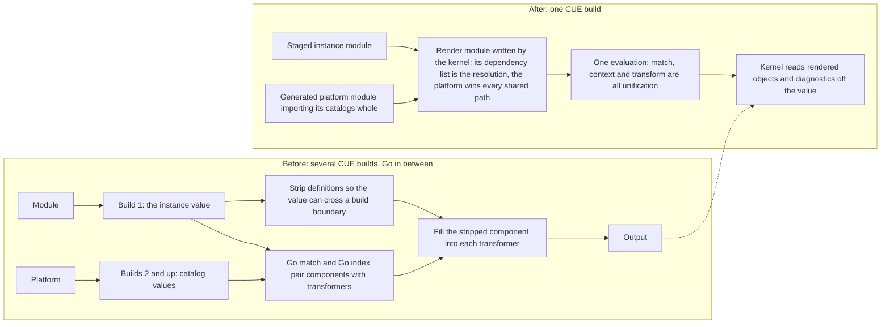

# Enhancement 0019: Kernel render path parity with pure CUE

> **Delivered (2026-09-04).** Every live decision is carried by this entry's delivery log or excused in it (27 landings; `task delivery ID=0019`). The design is closed: a correction is a new enhancement that amends it, and `task show ID=0019` lists any.

The kernel is the Go code that turns a module into Kubernetes objects. A transformer is the CUE definition that does the turning. Before rendering, the kernel converted each component to plain data, and that conversion deleted every definition field on it, so the computed identity a transformer needs did not exist. This entry removed that conversion.

All entries: [INDEX.md](../../INDEX.md). How this one relates to others: [GRAPH.md](../../GRAPH.md). Metadata: [config.yaml](config.yaml).

## Summary

**Plain CUE unification is the contract; one build per render is what makes it stick (D1).** A pure-CUE control settles it: unifying a real component into a real transformer preserves every field and passes strict validation. The kernel was the only thing removing anything, and the stated reason for the conversion does not reproduce.

**Phase A makes the current path honest.** Fill the component input from the unstripped value and fill the instance input for the first time (D3). Remove the stripping call from the render path and then from the public surface. Transformers read the computed object name instead of deriving it (D15), and that name's default becomes instance-qualified, flipped before the sweep so rendered fleets see no change (D16).

**Phase B removes the reason the strip was reachable: one CUE build per render (D9).** The kernel stages the instance and the platform into a generated render module and evaluates it once, so nothing crosses a build boundary and nothing needs stripping. That collapse carries the platform reshape it requires:

- A registry entry imports its catalog and embeds the transformer map, replacing the scalar version (D5).
- The operator generates the platform package its custom resource describes (D6).
- Version skew becomes a kernel-detected signal, defaulting to warn-and-render (D7, D18).
- The shared-platform decision is superseded by shares-nothing renders (D8).
- Matching moves into the build with its verdicts as data (D10, D13, D14).

**The key artifact across both phases is the parity harness**, which compares the kernel's rendered value against pure-CUE unification of the same inputs. It lands before any fix, and it stays afterwards as the alarm against a future Go-side transformation.

**The architecture being replaced is the expensive one.** Eight experiments measured it: the shared-platform model races under concurrent render (2321 detector reports) and retains 348 MB per render, while a shares-nothing single build wins by 2.5x to 5.5x and retains 117 KB.

**One finding changes the authoring contract on its own (D11).** CUE resolves references lexically, so a transformer must re-declare a slot in its own body to reference it. The transformer context becomes a view of the other two inputs (D12).

## How it works

The kernel used to evaluate the module and each catalog in separate CUE builds, then stitch them together in Go. It matched in Go, stripped the component's definitions so the value could cross a build boundary, then filled the stripped value into each transformer. That strip is exactly where the kernel's output diverged from what plain CUE unification of the same inputs produces. Now the kernel writes one throwaway render module whose dependency list is the resolution, so the platform's tidied list wins every shared path and a module cannot pick which transformer bytes run. It evaluates once: matching, context and transform are all unification, and the kernel just reads the rendered objects and diagnostics off the value. A differential harness asserts old and new agree, fixture by fixture.

## Documents

1. [01-problem.md](01-problem.md): the render path forks one component into two values and hands the transformer the lossy branch; the premise that justified it does not hold in CUE; and the architecture that made it reachable also races, retains and serialises
1. [02-design.md](02-design.md): parity as the contract, the differential oracle, the fills, the single-build render step, the platform shape that makes it resolvable, what matching costs, and the fixture that has to move first
1. [03-decisions.md](03-decisions.md): the decision log, D1 to D26
1. [04-graduation.md](04-graduation.md): what had to hold before draft became accepted
1. [05-risks.md](05-risks.md): risks, drawbacks, alternatives not taken
1. [06-operational.md](06-operational.md): rollout, versioning, rollback, and the two-phase landing order with its interim operator stopgap
1. [07-questions.md](07-questions.md): the open-questions register, OQ1 to OQ14

Compilable CUE is split by whether it proposes a schema definition. [`schemas/`](schemas/) is the schema delta and holds the three decisions that change it, D5, D12 and D16, with worked examples pinned by hidden assertions plus the must-fail cases carrying the exact observed error text, and a pre-drafted spec co-update. [`contracts/`](contracts/) carries everything else with a mechanical surface, which is most of this entry: the parity contract, the fill obligations, the execution unit, the authoring obligations, the render build with its promotion, isolation and ordering rules, platform-package generation, skew policy and matching-in-build. Landing order is deliberately absent from both, because decomposing into small changes is delivery's surface (D4). [`experiments/`](experiments/) holds thirteen concluded experiments, including the pure-CUE control the whole entry rests on and the cost measurements above.

## Scope

### In scope

**Phase A, parity on the current path:**

- Making pure-CUE unification the reference semantics of the render path, enforced by a differential parity harness rather than by review.
- Filling the component input from the unstripped component value, so definition fields reach transformers.
- Filling the instance input, the third input the schema declares and the kernel has never supplied.
- Removing the stripping call from the render path and then from the public kernel surface, with the migration entry that break requires.
- Repairing the flow test's instance construction, which severs the reference wiring and must land with the slice that exposes definitions rather than after it.
- Recording the lexical-declaration rule as an authoring obligation.
- The instance-qualified name default (D16): a component's resource name defaults to the instance name joined to the component name, validated against the name type with a hidden assertion for a legible overlong refusal, instead of the bare component name. The flip lands **before** the sweep, so it is output-neutral for rendered fleets and closes the computed-versus-rendered divergence a schema issue had raised.
- The read-only names contract (D15): transformers read the component's computed name and its DNS variants for the component's **primary object** and never derive that name; generation stays upstream on the component. The sweep over all fifty first-party transformers is gated on the component fill and on the D16 flip, and on byte-identical goldens. It carries three carve-out classes, namely exact-name kinds, secondary and multi-object names, and cross-object references, and it deletes the resource-name trait and its helper in favour of the metadata field.
- The fleet revalidation: residual renames, where an explicit resource name starts winning and trait users move to the schema field, land in the staging fleet without a deprecation cycle, per the alpha stance.
- The ordering migration note (OQ14): removing the strip changes list ordering for modules that assemble environments conditionally, so the note attaches to Phase A's landing rather than to the collapse.

**Phase B, the single-build collapse:**

- The render step as one CUE build per render (D9): the kernel-generated render module, its module file as the resolution, directory replacements for the unpublished inputs, and the invariant on what that file owes.
- Registry entries carrying the catalog by import, with the scalar version removed (D5) and the composed transformer map becoming derived.
- The operator generating the platform package its custom resource describes (D6).
- Kernel-detected, caller-configured skew between a module's catalog version and its platform's (D7).
- Superseding the shared-platform architecture decision with shares-nothing renders and a build-context lifetime rule (D8), including removal of the operator's single held platform slot.
- Matching moving into the render build with verdicts as data, per the measured glue shape (D10); the provenance carve-out is deleted rather than ported.
- The materialize package shrinking to the point of deletion, replaced by the platform's own imports.

### Out of scope

- **Matching semantics.** How components pair with transformers is untouched in both phases. The gate for D10 is that the moved matcher reproduces the kernel's exact pair set. Where matching *executes* changes; what it *decides* does not.
- **Changing the execution unit.** One component per transform evaluation is the original design intent and stays (D2).
- **Removing the instance input from the schema.** It is intended surface; the fix is to fill it (D3).
- **Per-transformer selection in the platform file.** D5 embeds a catalog's transformer map whole; choosing among transformers belongs to enhancement [0015](../../0015/), as do the runtime-registration questions this entry defers there.
- **Publishing platforms to a registry.** Disallowed under D6 as revised: the generated platform package is build-local by construction and the reserved namespace stays reserved and unpublished.
- **The schema-side name workaround.** Copying the computed name into a regular field is made unnecessary rather than implemented, because the transformer sweep it motivated is now in scope (D15) and reads the projection instead of duplicating it.
- **Improving the empty-disjunction error.** Filling all three inputs removes the most common way to reach it; the message itself stays as unhelpful as it is today.
- **A publish-side gate forbidding unstated trait posture.** An unstated optional posture refuses as a build error rather than as a diagnostics row; making it data would need publish-side enforcement of an authoring rule, which belongs to the publish-gate family (enhancement [0011](../0011/)), not here.

## Deviations from Design

None at this stage. Update when implementation lands.

## Cross-References

| Document | Purpose |
| -------- | ------- |
| `library/CONSTITUTION.md` | Kernel neutrality and batch-size principles governing every slice here |
| `library/adr/002-concurrent-render-shared-materialized-platform.md` | Superseded by D8; gains the superseded-by header in a Phase B slice |
| `library/adr/003-no-cross-build-fillpath-into-closed-values.md` | The no-cross-build-fill invariant, and the federation premise D9 retires |
| `experiments/00-purecue-definitions/` | The pure-CUE control this entry rests on |
| `library/docs/design/transformer-output-hidden-field-scope-bug.md` | The closedness corruption whose hazard shape was probed and did not reproduce |
| `library/docs/design/cue-closedness-regression-alpha2.md` | The unfixed upstream evaluator regression the canary pair pins |
| `library/opm/compile/execute.go` | The Phase A fill site |
| `library/opm/compile/finalize.go` | The strip, removed in Phase A |
| `library/opm/compile/match.go` | The Go matcher D10 moves into the build; its provenance carve-out is deleted with federation |
| `library/opm/errors/match.go` | Message text naming the reverse index, reworded under D17 |
| `library/.claude/skills/security-audit/SKILL.md` | Documents the strip as a constraint guard; rewritten in the slice that removes it |
| `library/opm/kernel/compile.go` | Where one components value forks into two |
| `library/opm/kernel/phases.go` | The public kernel wrapper over the strip |
| `library/opm/materialize/index.go` | The catalog index that shrinks or goes under D5 |
| `library/opm/schema/paths.go` | Path constants; gains the instance input |
| `library/opm/schema/context.go` | Go-side context construction, deleted under D12's projection |
| `library/opm/kernel/flow_integration_test.go` | The fixture whose instance construction severs the reference wiring |
| `library/opm/materialize/composed_open_test.go` | The closed-platform corruption guard that must keep passing |
| `library/opm/internal/cueregression/closedness_test.go` | The CUE canary pair |
| `library/MIGRATIONS.md` | Records the strip removal and the ordering note |
| `core/src/platform.cue` | The registry, reshaped by D5, with a spec co-update under the schema-editing protocol |
| `core/src/transformer.cue` | The transform's three declared inputs and the transformer context |
| `core/src/component.cue` | The computed names the render path cannot currently read |
| `catalog_opm/src/` | The fifty transformers whose hand-rolled name formulas the sweep rewrites to read the computed name (D15), plus the resource-name trait and helper, both deleted |
| `core/SPEC.md` | The normative co-update for D5, D12, D16 and D17 |
| `opm-operator/api/v1alpha1/platform_types.go` | The custom resource that keeps naming a catalog coordinate while the operator generates the package (D6) |
| `opm-operator/internal/platform/store.go` | The single held slot that loses its reason to exist under D8 |
| `cli/` | Render command configuration, D7's policy surface |
| `enhancements/0015/` | Provider classes and transformer registration; two open questions defer there, and its integration surface re-baselines when this entry is accepted |
| `enhancements/0011/` | The publish-gate family; candidate home for the unstated-posture gate |
