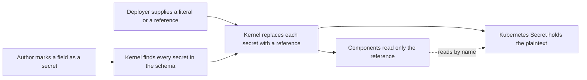

<!-- MOCKUP EXCERPT: the part of 0013 that five of its 36 decisions cover. See openspec/MOCKUP.md. -->

# 0013 design: Attribute-Declared Secret Fields

## How it works

The plaintext and the components take separate paths. They meet only inside the Secret object. Changing the environment changes the values, never the module.

## Design

### Declaring a secret

An author gives a secret field the type `#Secret`. The deployer fills it with a literal, `{value}`, or a reference, `{ref, key}`. Both are structs, so a module checks with plain `cue vet` and no OPM tool, and an unfilled secret shows up there by its path.

An attribute on the field holds the routing: group, key, type, immutable, description. Routing is the same in every environment, so it ships with the module. How a secret is supplied differs, so the deployer sets it, and switches without a new module release.

A `#Secret` field with no attribute is still found. It gets the group `secrets` and a key made from its path, so a forgotten attribute never leaks a secret.

### Resolving secrets

Before the components are built, the kernel replaces every secret with a reference. A literal becomes a reference to the Secret OPM creates. A reference passes through untouched, with no instance prefix. After that, nothing can tell the two forms apart, and no `value` is left in the render. [Why this rewrite](evidence/rewrite-alternatives.md).

So a module cannot read a secret's value: not inside a string, and not in a condition. Trying gives an error that names the config path.

An authored instance package cannot hold a literal. The kernel keeps plaintext out only where it assembles the values itself: a CR's values, or a values file. A delivery path that has only a package uses references or a named source.

### Exporting

An exported instance has each literal secret encrypted with SOPS. Everything else stays readable, so the file can be reviewed and diffed. The GitOps tool decrypts it in the cluster, and the decrypted instance renders exactly like the original. [Why this works with Flux](evidence/export-encryption.md).

This changes a promise of 0014, which wrote every value unchanged. It ships in the second wave, after 0014's export.

## Risks

- **A literal in a custom resource is plaintext at rest.** Accepted and documented. Use a reference in production.
- **Authors will try to read a secret's value.** It is the first thing they try when they want a secret in a rendered file. The authoring docs must say it cannot be done.

## Alternatives

Options that were considered and rejected.

- **Declaring: a plain string field.** The deployer could not say "this Secret already exists".
- **Declaring: saying "it already exists" elsewhere (an attribute argument, a prefixed string, a sibling block).** Each puts a cluster fact in the published module, or makes OPM parse meaning out of user data.
- **Declaring: a bare string for the common case.** A module would check only with the kernel, and every place that reads a secret would need a new type.
- **Declaring: finding secrets by the attribute alone.** An unmarked field would reach the render as plain text.
- **Declaring: finding secrets by the type alone.** The routing overrides would have no home.
- **Declaring: an unmarked secret field as an error.** It has one clear meaning already; an error adds friction and no safety.
- **Resolving: a side table that modules read.** Authors would wire through an unnatural path, and the plaintext would stay where it was.
- **Resolving: letting a literal and a reference share one value.** The plaintext stays in the components; safety becomes a convention.
- **Resolving: unpacking a package to pull its values out.** New machinery that bypasses the loader's checks and loses source positions.
- **Exporting: encrypting the rendered manifests.** On this path the committed file is the instance, not its manifests.

## Open questions

- **OQ9: Does a field that copies another secret field get its own entry?** Blocking: implementation.
- **New, found by this rewrite: 0014's export warning says OPM cannot tell which values are secret.** After this change it can. Does the warning change? Blocking: implementation.
