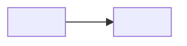

<!-- THE DESIGN. Owner: the proposer decides; an agent may draft. Reader: someone who asks "how does it work, and why this way?".
     It reads as one explanation, top to bottom. There are no numbered decisions.
     Caps: at most 7 themes. A theme has at most 120 words, in paragraphs of at most three sentences. At most 10 alternatives, one line each. -->

# NNNN design: <Title>

## How it works

<At most three sentences on what the diagram shows.>

## Design

### <Theme, as a plain phrase>

<What holds, and the reason, in short paragraphs. Say what the user sees first. Give the reason right after the thing it explains.>

### <Next theme>

<...>

## Risks

- **<Risk>.** <What limits it, in one sentence.>

## Alternatives

Options that were considered and rejected.

- **<Theme>: <the option>.** <Why it lost, in one sentence.>

## Open questions

- **OQ1: <Question>** Blocking: <acceptance, deferrable or implementation>.
