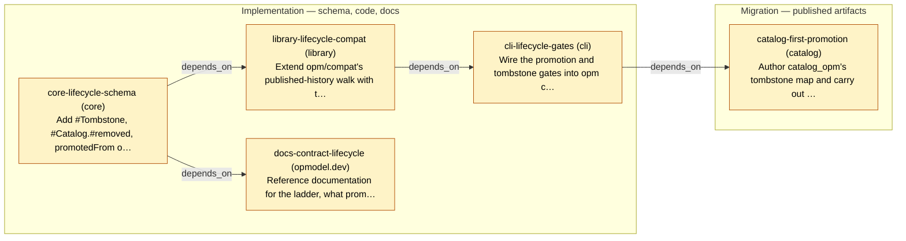

# Delivery Plan — Contract Promotion and Retirement

<!-- Generated by `task plans:graph` — do not edit by hand. -->

Implements: 0020

| ID | Phase | Repo | Status | Depends on | Concern |
| -- | ----- | ---- | ------ | ---------- | ------- |
| core-lifecycle-schema | implementation | core | planned | - | Add #Tombstone, #Catalog.#removed, promotedFrom on the three contract kinds, and the #PromotionGate / #TombstoneGate definitions, with the SPEC.md sections for each.  |
| library-lifecycle-compat | implementation | library | planned | core-lifecycle-schema | Extend opm/compat's published-history walk with the three cross-build rules: cross-level promotion comparison, absent-and-not-tombstoned, and the seasoning floor on withdrawal.  |
| cli-lifecycle-gates | implementation | cli | planned | library-lifecycle-compat | Wire the promotion and tombstone gates into opm catalog publish beside the existing compatibility gate, and surface lifecycle state through opm catalog registry check as a D35-style aid.  |
| docs-contract-lifecycle | implementation | opmodel.dev | planned | core-lifecycle-schema | Reference documentation for the ladder, what promotion means and costs, how retirement is recorded, and the guidance against rung-skipping that D5 keeps out of the gate.  |
| catalog-first-promotion | migration | catalog | planned | cli-lifecycle-gates | Author catalog_opm's tombstone map and carry out the first real promotion by dual-shipping, as the proof case for the design against a live fleet.  |
