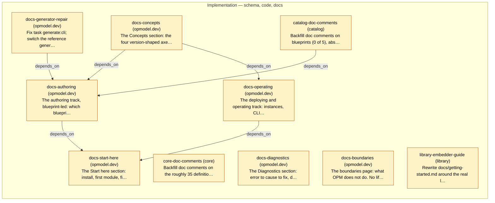

# Delivery Plan — Documentation Architecture

<!-- Generated by `task plans:graph` — do not edit by hand. -->

Implements: 0018

| ID | Phase | Repo | Status | Depends on | Concern |
| -- | ----- | ---- | ------ | ---------- | ------- |
| docs-generator-repair | implementation | opmodel.dev | planned | - | Fix `task generate:cli`; switch the reference generator from text scraping to evaluated CUE so all 70 members carry descriptions; split generated reference by family; fix the src-excluding tree bug.   |
| catalog-doc-comments | implementation | catalog | planned | - | Backfill doc comments on blueprints (0 of 5), abstraction resources (1 of 11) and traits (6 of 27); add a CI gate refusing a new member that ships without one.   |
| core-doc-comments | implementation | core | planned | - | Backfill doc comments on the roughly 35 definitions with no SPEC.md section, types.cue foremost, so generated reference entries carry prose rather than a bare field list.   |
| docs-concepts | implementation | opmodel.dev | planned | - | The Concepts section: the four version-shaped axes, fqn == modulePath, matchLabels versus metadata.labels, the component derivation rule. Mined from SPEC.md Rationale and rewritten for a public reader.   |
| docs-diagnostics | implementation | opmodel.dev | planned | - | The Diagnostics section: error to cause to fix, distinguishing unresolved demand, unhandled trait per posture, identity mismatch at acquire and at materialize, and a named build that is not published.   |
| docs-boundaries | implementation | opmodel.dev | planned | - | The boundaries page: what OPM does not do. No lifecycle hooks, workflows, rollback, reverse handoff, export or provider classes. Draft systems named as absent, never as forthcoming.   |
| library-embedder-guide | implementation | library | planned | - | Rewrite docs/getting-started.md around the real lifecycle including the mandatory Materialize step it omits today, so that following it end to end produces working code.   |
| docs-authoring | implementation | opmodel.dev | planned | docs-concepts, docs-generator-repair, catalog-doc-comments | The authoring track, blueprint-led: which blueprint to start from, which traits attach to it, cross-member interactions, interleaved with generated member entries.   |
| docs-operating | implementation | opmodel.dev | planned | docs-concepts | The deploying and operating track: instances, CLI versus operator ownership, handoff, platform subscriptions, and the deletion and prune hazard page.   |
| docs-start-here | implementation | opmodel.dev | planned | docs-authoring, docs-operating | The Start here section: install, first module, first render, first deploy. The graduation gate walks it end to end on a clean machine rather than asserting it.   |
